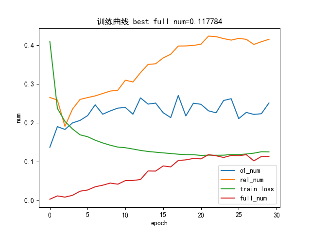
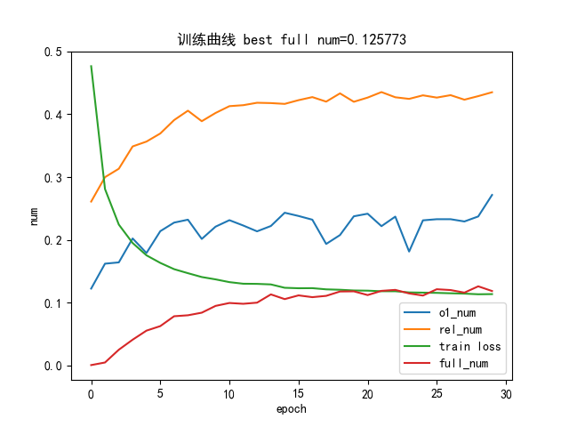

# 基于lstm与bert的联合训练三元组抽抽取任务

---

- [X]  基本baseline -21/12/22
- [X]  模型调参优化，生成训练过程以及结果展示文件 -22/1/3

# 一，项目介绍

数据来源:[这个项目中的人物关系表.xlsx和rel_dict.json](https://github.com/percent4/people_relation_extract/tree/master/data)

## 1，原理

三元组抽取有开放式和封闭式两种，这次任务中因为要实际应用，选取封闭式联合训练的抽取方式，有两个训练任务，分别为关系分类预测和头尾实体抽取（序列标注）。通过使用lstm与bert两个模型的超参数搜索得到任务结果

## 2.项目结构

```bash
│  config.py  # 配置文件
│  main.py  # 训练主函数
│  predict.py  # 预测函数，能直接用lstm的模型，上传到github了
│  requirements.txt
│
├─bert-base-chinese  # hugging face开源的bert
│      config.json
│      pytorch_model.bin
│      vocab.txt
│
├─data
│      rel_dict.json  # 关系分类的schema
│      vocab.txt  # bert的vocab
│      人物关系表.xlsx  # 任务关系三元组数据，这个数据质量比较低，所以最终分类效果很差
│
├─output
│  └─model
│          epoch_30.pth  # 已上传的lstm模型，可以直接使用，作用是抽取两个人之间关系
│          report-model-0.01-0.006-0.xxx.png  # 超参数搜索后的最优lstm与bert训练图
│
├─src
│  │  evaluator.py  # 评估类，包括统计准确率，打印内容，画图等功能
│  │  loader.py  # 数据加载类
│  │  model.py  # 模型定义类
```

## 3.训练结果图示

> lstm



> bert



## 二，使用项目

环境：

```bash
matplotlib==3.3.4
numpy==1.20.1
pandas==1.2.4
torch==1.8.2+cu111
transformers==4.14.1
```

## 1.下载

`git clone`

## 2.（可选）处理自己的数据成本项目数据格输入式

```bash
处理成如下的xlsx文件，或者根据自己的三元组数据集修改src.loader中的读取部分代码

```


| 人物1  | 人物2  | 关系 | 文本                                                           |
| -------- | -------- | ------ | ---------------------------------------------------------------- |
| 韩庚   | 卢靖姗 | 夫妻 | 昨天有个热搜，韩庚和卢靖姗结婚了，将在31日举行婚礼。           |
| 巩俐   | 黄和祥 | 夫妻 | 婚后巩俐与黄和祥把家安在香港，过着普通人的平凡生活。           |
| 程砚秋 | 果素瑛 | 夫妻 | 程砚秋与果素瑛生有三子一女，即程永光、程永源、程永江和程慧贞。 |
| 程砚秋 | 程永光 | 父母 | 程砚秋与果素瑛生有三子一女，即程永光、程永源、程永江和程慧贞。 |

## 3.训练

`python main.py`

打印内容实例

```bash
2021-12-22 23:11:45,617 - __main__ - INFO - 测试第35轮模型效果:
2021-12-22 23:11:46,453 - __main__ - INFO - o1_acc : 0.2466494845360825 
2021-12-22 23:11:46,453 - __main__ - INFO - rel_acc : 0.2752577319587629 
2021-12-22 23:11:46,453 - __main__ - INFO - o2_acc : 0.17190721649484536 
2021-12-22 23:11:46,453 - __main__ - INFO - full_match_acc : 0.048195876288659796 
2021-12-22 23:11:46,453 - __main__ - INFO - --------------------
```

## 4.预测

`python predict.py`

打印内容示例

```bash
模型加载完毕!
('帕克', '师生', '')
('田际云', '师生', '余玉琴')

```
